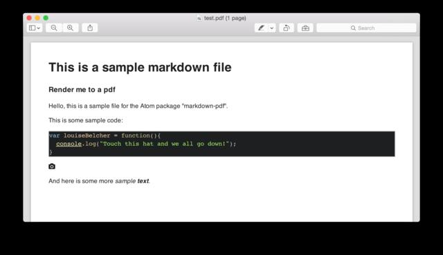
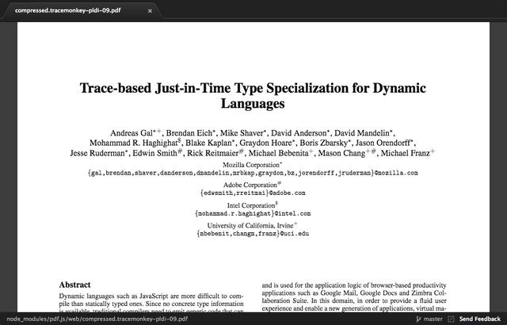

# Generate PDF/View from MarkDown sources (atom or CLI solutions)

## Atom

### markdown-pdf
Convert markdown to pdf, png or jpeg on the fly.

https://atom.io/packages/markdown-pdf


### PDF View package
[pdf-view](https://atom.io/packages/pdf-view)
Atom PDF viewer based on PDF.js
[https://atom.io/packages/pdf-view](https://atom.io/packages/pdf-view)



### How-to generate PDF from Markdown
http://kevin.deldycke.com/2012/01/how-to-generate-pdf-markdown/

## CLI (solution)

### Gimli
https://github.com/walle/gimli
Gimli is an utility that was explicitly written with GitHub in mind.
Gimli is written in Ruby, so let’s install it the Ruby way:

```bash
$ sudo apt-get install wkhtmltopdf
$ [sudo] gem install gimli
```

#### [`require': no such file to load — mkmf (LoadError)]((http://stackoverflow.com/a/8113213))
=> [http://stackoverflow.com/a/8113213](http://stackoverflow.com/a/8113213)
```bash
$ sudo apt-get install ruby-dev
```

# Remarques

- Gimli a l’air plus sympa
- mais je n’ai pas encore régler autant que possible la version module de atom.
- L’avantage de Gimli:
  + export vers PDF directement via CLI
  + gestion des hypers liens (internet)
