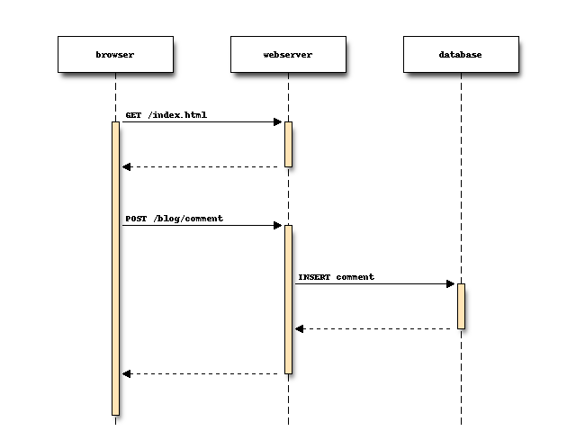

# Table of Contents
1. [Doc sur Sphinx](#Documenting Your Project Using Sphinx)
2. [Diagramme UML avec Sphinx](# UML: Diagramme avec/dans Sphinx)
  1. [blockdiag](# blockdiag - simple diagram images generator)


# Sphinx: Documentation sous Python

## Sources, références, liens, ...

### Documenting Your Project Using Sphinx
```
This covers just a few of the many many commands available via sphinx. For more, visit http://sphinx.pocoo.org/.

Also, another great site with just an overview of more common commands is http://docs.geoserver.org/trunk/en/docguide/sphinx.html.
```
https://pythonhosted.org/an_example_pypi_project/sphinx.html

#### Example
https://pythonhosted.org/an_example_pypi_project/sphinx.html#full-code-example

-> Resultat: https://pythonhosted.org/an_example_pypi_project/pkgcode.html

### reStructuredText Primer


http://sphinx-doc.org/rest.html

#### reStructuredText Markup Specification
http://docutils.sourceforge.net/docs/ref/rst/restructuredtext.html#bullet-lists

### 7. Documenting Python
```
The Python language has a substantial body of documentation, much of it contributed by various authors. The markup used for the Python documentation is reStructuredText, developed by the docutils project, amended by custom directives and using a toolset named Sphinx to post-process the HTML output.

This document describes the style guide for our documentation as well as the custom reStructuredText markup introduced by Sphinx to support Python documentation and how it should be used.
```
https://docs.python.org/devguide/documenting.html

#### Cross-linking markup, Paragraph-level markup
https://docs.python.org/devguide/documenting.html#doc-ref-role

### First Steps with Sphinx
```
This document is meant to give a tutorial-like overview of all common tasks while using Sphinx.
```

### The TOC Tree
```
Since reST does not have facilities to interconnect several documents, or split documents into multiple output files, Sphinx uses a custom directive to add relations between the single files the documentation is made of, as well as tables of contents. The toctree directive is the central element.
```
http://sphinx-doc.org/markup/toctree.html

### Referencing downloadable files
```
This role lets you link to files within your source tree that are not reST documents that can be viewed, but files that can be downloaded.

When you use this role, the referenced file is automatically marked for inclusion in the output when building (obviously, for HTML output only).
All downloadable files are put into the _downloads subdirectory of the output directory; duplicate filenames are handled.
```

http://sphinx-doc.org/markup/inline.html#role-download
http://stackoverflow.com/questions/8475865/in-python-sphinx-how-to-link-to-a-file-in-static-directory

### The Python Domain
`The Python domain (name py) provides the following directives for module declarations:`

http://sphinx-doc.org/domains.html#the-python-domain

### A TESTER: Publishing sphinx-generated docs on github
https://daler.github.io/sphinxdoc-test/includeme.html

github allows the publishing of static pages associated with a particular repository (called project pages), which you can read more about at http://pages.github.com/,

I frequently use Sphinx (http://sphinx.pocoo.org/) for documenting projects, and would like to have my docs for a repo published to the gh-pages for that repo.

This strategy uses ideas from http://lucasbardella.com/report/hosting-your-sphinx-docs-in-github/, which uses a separate directory for docs and keeps the autogenerated stuff out of the main repo. This in contrast to suggestions on http://pages.github.com/, which does stuff within the repo directory. Using a separate docs dir made things easier for me to figure out and configure easier with the Sphinx makefile.

See http://daler.github.com/sphinxdoc-test for the Sphinx-generated version of this README, created using the commands documented in it...


### Referencing downloadable files
```
This role lets you link to files within your source tree that are not reST documents that can be viewed, but files that can be downloaded.

When you use this role, the referenced file is automatically marked for inclusion in the output when building (obviously, for HTML output only).
All downloadable files are put into the _downloads subdirectory of the output directory; duplicate filenames are handled.
```

http://sphinx-doc.org/markup/inline.html#role-download
http://stackoverflow.com/questions/8475865/in-python-sphinx-how-to-link-to-a-file-in-static-directory

### The Python Domain
`The Python domain (name py) provides the following directives for module declarations:`

http://sphinx-doc.org/domains.html#the-python-domain

### A TESTER: Publishing sphinx-generated docs on github
https://daler.github.io/sphinxdoc-test/includeme.html

github allows the publishing of static pages associated with a particular repository (called project pages), which you can read more about at http://pages.github.com/,

I frequently use Sphinx (http://sphinx.pocoo.org/) for documenting projects, and would like to have my docs for a repo published to the gh-pages for that repo.

This strategy uses ideas from http://lucasbardella.com/report/hosting-your-sphinx-docs-in-github/, which uses a separate directory for docs and keeps the autogenerated stuff out of the main repo. This in contrast to suggestions on http://pages.github.com/, which does stuff within the repo directory. Using a separate docs dir made things easier for me to figure out and configure easier with the Sphinx makefile.

See http://daler.github.com/sphinxdoc-test for the Sphinx-generated version of this README, created using the commands documented in it...


## Probleme avec autodoc et les Décorateurs Python

###  @task decorator causes Sphinx autodoc to lose fuction signature #569
https://github.com/fabric/fabric/issues/569

->  Use 3rd party "decorator" module to fix introspection for decorated functions #103
https://github.com/fabric/fabric/issues/103

=> use functools.wraps

#### 9.2. functools — Higher-order functions and operations on callable objects¶
https://docs.python.org/3.2/library/functools.html

#### Timing Decorator using wraps
http://stackoverflow.com/a/27737385
```python
from functools import wraps
from time import time

def timing(f):
    @wraps(f)
    def wrap(*args, **kw):
        ts = time()
        result = f(*args, **kw)
        te = time()
        print 'func:%r args:[%r, %r] took: %2.4f sec' % \
          (f.__name__, args, kw, te-ts)
        return result
    return wrap
```    

#### Implementation dans TrafiPollu
```python
def timer_decorator(f, prefix="-> TIMER\n\t", postfix=""):
    """

    :param f:
    :param prefix:
    :param postfix:
    :return:
    """
    @wraps(f)
    def wrap(*args, **kw):
        """

        :param args:
        :param kw:
        :return:
        """
        global t
        try:
            with Timer() as t:
                result = f(*args, **kw)
        finally:
            print '{0:s}{1:s} took {2:.03f} sec.{3:s}'.format(prefix,
                                                              f.__name__,
                                                              t.interval,
                                                              postfix)
        return result
    return wrap
```


## UML: Diagramme avec/dans Sphinx

Solutions pour intégrer des visualisations de diagrammes UML dans la documentation générée par Sphinx.

- page wiki: [Sequence Diagram](https://en.wikipedia.org/wiki/Sequence_diagram)
- stackoverflow recherche: [generate uml sequence diagrams with python or perl](http://stackoverflow.com/questions/13136247/generate-uml-sequence-diagrams-with-python-or-perl)
- site intéressant sur le sujet: [Creating diagrams in Sphinx](http://build-me-the-docs-please.readthedocs.org/en/latest/Using_Sphinx/UsingGraphicsAndDiagramsInSphinx.html)

### blockdiag - simple diagram images generator

+ website: [http://blockdiag.com/en/](http://blockdiag.com/en/)
  + index: [http://blockdiag.com/en/blockdiag/index.html](http://blockdiag.com/en/blockdiag/index.html)

#### [Introduction of blockdiag](http://blockdiag.com/en/blockdiag/introduction.html#features)


##### Features
  + Generate block-diagram from dot like text (basic feature).
  + Multilingualization for node-label (utf-8 only).
  + Sphinx embedding (using sphinxcontrib-blockdiag package)

##### Installation

```bash
$ sudo -E pip install sphinxcontrib-blockdiag
$ sudo apt-get install fonts-ipafont-gothic
```
Installation du package `fonts-ipafont-gothic` pour la font: `ipagp.ttf`

##### Utilisations, Tests

###### Python (test)
répertoire: `UML_diagrams/seqdiag`

Listes des fichiers:
```bash
UML_diagrams/seqdiag (version_IGN *) $ ls -1
diagram_definition.seqdiag
diagram.png
diagram_sequence.py
script_build_diagram_sequence.sh
```

- diagram_definition.seqdiag: source script définissant le diagramme à généreport
- diagram_sequence.py: script python pour
  + charger le diagramme (décrit par `diagram_definition.seqdiag`)
  + le rendre via la lib
  + sauvegarde dans: `diagram.png`
- diagram.png: build du diagramme généré
- script_build_diagram_sequence.sh: script bash pour lancer la génération d'une image d'un diagramme

Exemple de rendu:


###### Sphinx

=> [sphinxcontrib-blockdiag](http://blockdiag.com/en/blockdiag/sphinxcontrib.html#sphinxcontrib-blockdiag)

- Installation
  + Python Package
    ```bash
    sudo -E pip install sphinxcontrib-blockdiag
    ```
  + Configure Sphinx
    ```python
    extensions = ['sphinx.ext.graphviz', 'sphinxcontrib.blockdiag']
    # Fontpath for blockdiag (truetype font)
    blockdiag_fontpath = '/usr/share/fonts/truetype/ipafont/ipagp.ttf'
    ```
- Utilisation: `tp_composants.rst`
  ```sphinx
    BlockDiag:

    .. blockdiag::

      blockdiag admin {
          A -> B
      }
    ```
- Pro/Con
  * \+ Intégration simple: Python/Sphinx
  * \+ Rendu: visuellement jolie
  * \- Out of Date: la page web du projet date de 2011 (les images de rendues ne sont pas plus présentes par exemple)
  * \- Limitation(s): ça semble spécialisé pour le rendu de diagrammes de séquences (uniquement)


### PlantUML

[Welcome to plantuml’s documentation](http://pythonhosted.org/plantuml/#module-plantuml)


+ website: [http://fr.plantuml.com/](http://fr.plantuml.com/)
  + download: [http://plantuml.com/download.html](http://plantuml.com/download.html)
    - last version: [http://sourceforge.net/projects/plantuml/files/plantuml.jar/download](http://sourceforge.net/projects/plantuml/files/plantuml.jar/download)
  + examples de diagrammes de séquences: [Sequence Diagram][http://plantuml.com/sequence.html#Basic_examples]
  + TESTS: [page sur le test de l'installation (important)](http://fr.plantuml.com/graphvizdot.html)

- Installation (IGN)
  + Configuration pour Sphinx
    - Installation
      + Python Package
        ```bash
        sudo -E pip install sphinxcontrib-plantuml
        ```

    ```python
    extensions = ['sphinx.ext.graphviz', 'sphinxcontrib.plantuml']
    plantuml = 'java -jar ' + os.path.dirname(__name__) + 'utils/plantuml.jar'
    ```
    - Utilisation: `tp_composants.rst`

    ```sphinx
    PlantUML:

    .. uml::

        @startuml
        Alice -> Bob: Hi!
        Alice <- Bob: How are you?
        @enduml
    ```
    - Pro/Con
      * \+ Maintenue: semble plutot a jour et maintenue encore
      * \+ Complet: semble complet et capable de décrire beaucoup de diagrammes UML
      * \- Rendu: de base, moins joli (que blockdiag), mais à voir avec configuration/customisation

  + Configuration pour Linux
    Plus complexe, passe par un serveur online pour générer les images.
    Pas (encore) réussi à configurer correctement pour passer à travers le proxy IGN
    Potentiellement intérêt limité !

#### Salt
Salt is a subproject included in PlantUML that may help you to design graphical interface.

+ website: [http://plantuml.com/salt.html](http://plantuml.com/salt.html)


+ Configuration pour Sphinx
  - Utilisation: `tp_composants.rst`

    ```sphinx
    Salt:

    .. uml::

      @startsalt
      {+
      {/ <b>General | Fullscreen | Behavior | Saving }
      {
          { Open image in: | ^Smart Mode^ }
          [X] Smooth images when zoomed
          [X] Confirm image deletion
          [ ] Show hidden images
      }
      [Close]
      }
      @endsalt
    ```
